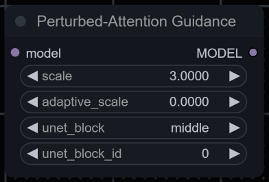
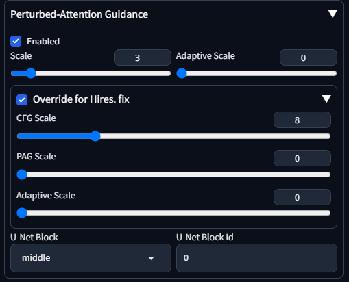

# Perturbed-Attention Guidance for ComfyUI/Forge

Implementation of [Self-Rectifying Diffusion Sampling
with Perturbed-Attention Guidance (D. Ahn et al.)](https://ku-cvlab.github.io/Perturbed-Attention-Guidance/) as an extension for [ComfyUI](https://github.com/comfyanonymous/ComfyUI) and [SD WebUI Forge](https://github.com/lllyasviel/stable-diffusion-webui-forge).

Tested to work with SD1.5 and SDXL.

> [!NOTE]
> Paper and demo suggest using CFG scale 4.0 with PAG scale 3.0 applied to U-Net's middle layer 0, but feel free to experiment.
>
> Sampling speed without `adaptive_scale` is similar to Self-Attention Guidance (x0.6 of usual it/s).

## Installation

### ComfyUI

`git clone https://github.com/pamparamm/sd-perturbed-attention.git` into `ComfyUI/custom-nodes/` folder.

### SD WebUI (Forge)

`git clone https://github.com/pamparamm/sd-perturbed-attention.git` into `stable-diffusion-webui-forge/extensions/` folder.

### SD WebUI (Auto1111)
Currently not implemented. PRs are welcome!

## Parameters

- `scale`: PAG scale, has some resemblance to CFG scale - higher values can both increase structural coherence of the image and oversaturate/fry it entirely.
- `adaptive_scale`: PAG dampening factor, it penalizes PAG during early denoising stages, resulting in overall speedup. Should be << than `scale`.
- `unet_block`: Part of U-Net to which PAG is applied, original paper suggests to use `middle`.
- `unet_block_id`: Id of U-Net layer in a selected block to which PAG is applied. PAG can be applied only to layers containing Self-attention blocks.