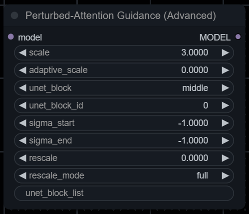

# Perturbed-Attention Guidance for ComfyUI / SD WebUI (Forge)

Implementation of [Self-Rectifying Diffusion Sampling with Perturbed-Attention Guidance (D. Ahn et al.)](https://ku-cvlab.github.io/Perturbed-Attention-Guidance/) as an extension for [ComfyUI](https://github.com/comfyanonymous/ComfyUI) and [SD WebUI (Forge)](https://github.com/lllyasviel/stable-diffusion-webui-forge).

Works with SD1.5 and SDXL.

Doesn't work with Stable Cascade.

> [!NOTE]
> PAG may produce striped "noise", setting `sigma_end` to 0.7 or higher may reduce striped patterns.

> [!NOTE]
> Paper and demo suggest using CFG scale 4.0 with PAG scale 3.0 applied to U-Net's middle layer 0, but feel free to experiment.
>
> Sampling speed without `adaptive_scale` or `sigma_start` / `sigma_end` is similar to Self-Attention Guidance (x0.6 of usual it/s).

## Installation

### ComfyUI

Basic PAG node is now included into ComfyUI - you don't have to install this extension unless you want to mess with additional parameters.

To install the advanced PAG node from this repo, you can either:

- `git clone https://github.com/pamparamm/sd-perturbed-attention.git` into `ComfyUI/custom-nodes/` folder.

- Install it via [ComfyUI Manager](https://github.com/ltdrdata/ComfyUI-Manager) (search for custom node named "Perturbed-Attention Guidance").

- Install it via [comfy-cli](https://comfydocs.org/comfy-cli/getting-started) with `comfy node registry-install sd-perturbed-attention`

### SD WebUI (Forge)

`git clone https://github.com/pamparamm/sd-perturbed-attention.git` into `stable-diffusion-webui-forge/extensions/` folder.

> [!NOTE]
> You can override `CFG Scale` and `PAG Scale` for Hires. fix by opening/enabling `Override for Hires. fix` tab.
> To disable PAG during Hires. fix, set `PAG Scale` under Override to 0.

### SD WebUI (Auto1111)

As an alternative for A1111 WebUI you can use PAG implementation from [sd-webui-incantations](https://github.com/v0xie/sd-webui-incantations) extension.

## Parameters

- `scale`: PAG scale, has some resemblance to CFG scale - higher values can both increase structural coherence of the image and oversaturate/fry it entirely.
- `adaptive_scale`: PAG dampening factor, it penalizes PAG during late denoising stages, resulting in overall speedup: 0.0 means no penalty and 1.0 completely removes PAG.
- `unet_block`: Part of U-Net to which PAG is applied, original paper suggests to use `middle`.
- `unet_block_id`: Id of U-Net layer in a selected block to which PAG is applied. PAG can be applied only to layers containing Self-attention blocks.
- `sigma_start` / `sigma_end`: PAG will be active only between `sigma_start` and `sigma_end`. Set both values to negative to disable this feature.
- `rescale_pag`: Acts similar to RescaleCFG node - it prevents over-exposure on high `scale` values. Based on Algorithm 2 from [Common Diffusion Noise Schedules and Sample Steps are Flawed (Lin et al.)](https://arxiv.org/abs/2305.08891). Set to 0 to disable this feature.
- `rescale_mode`:
  - `full` - takes into account both CFG and PAG.
  - `partial` - depends only on PAG.
- `unet_block_list`: Replaces both `unet_block` and `unet_block_id`, allows you to select multiple U-Net layers separated with commas. SDXL U-Net has multiple indices for layers, you can specify them using dot symbol (if not specified, PAG would be applied to the whole layer). Example value: `m0,u0.4` (PAG will be applied to middle block 0 and to output block 0 with index 4)
  - `d` means `input`, `m` means `middle` and `u` means `output`.
  - SD1.5 U-Net has layers `d0`-`d5`, `m0`, `u0`-`u8`.
  - SDXL U-Net has layers `d0`-`d3`, `m0`, `u0`-`u5`. In addition, each block except `d0` and `d1` has `0-9` index values (like `m0.7` or `u0.4`). `d0` and `d1` have `0-1` index values.